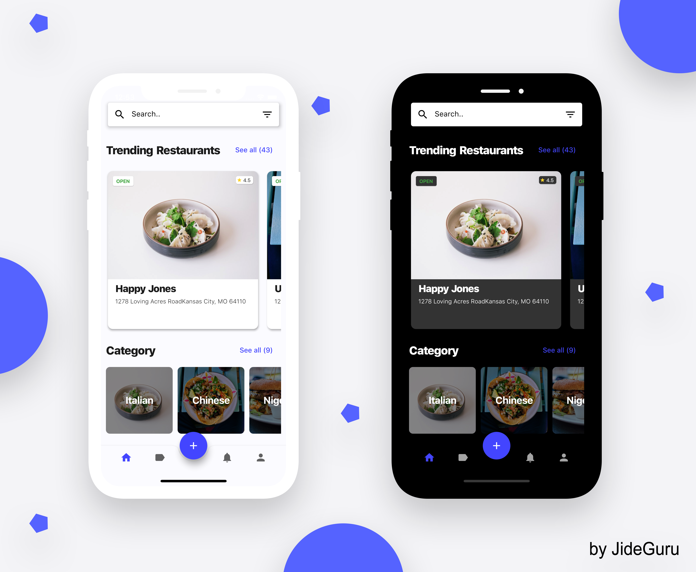
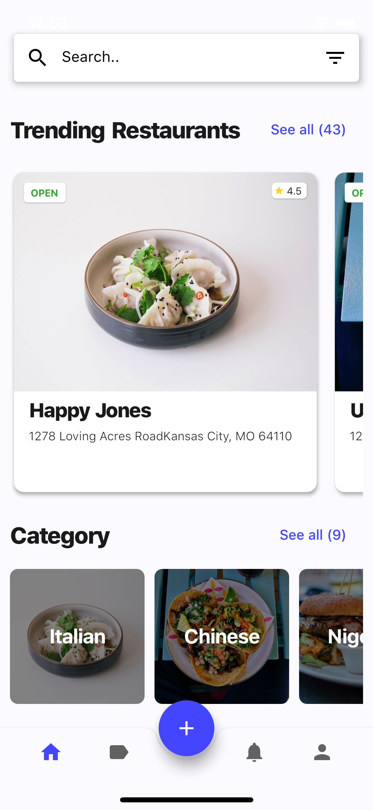
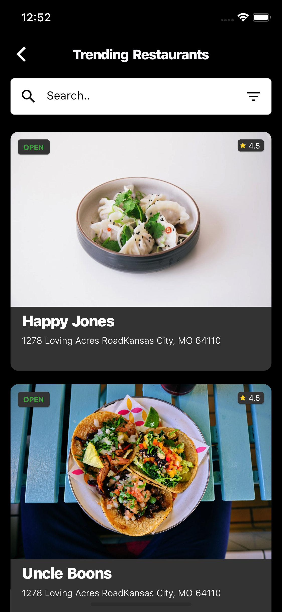
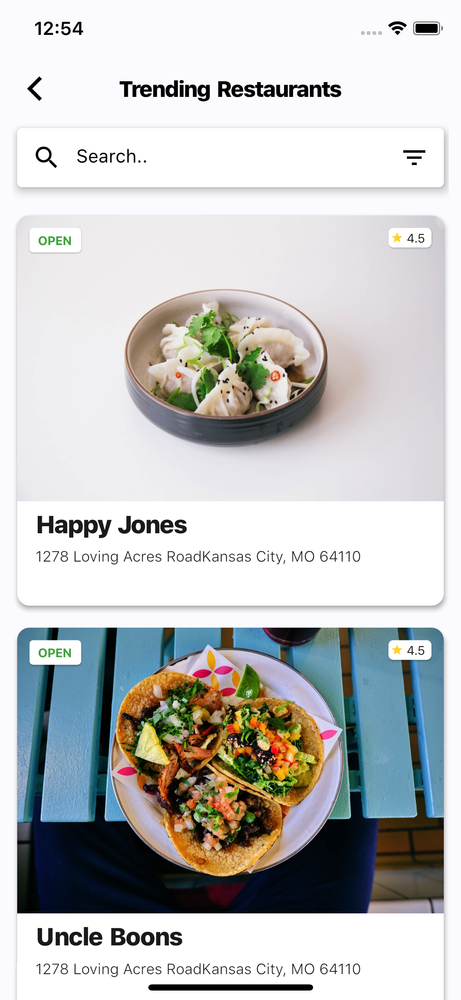

## Flitter_Food_App

E-Commerce app is a design implementaion of [Flitter_Food_App](https://user-images.githubusercontent.com/102571616/202905028-b3fc987f-c0c4-40e5-8d7c-ab393974e457.jpg) designed by [Morvin_Vaghasiya]

[](https://hits.seeyoufarm.com)  [](https://github.com/Thealphamerc/Flutter_Food_App)    [](https://github.com/login?return_to=%2FTheAlphamerc%flutter_ecommerce_app)  


## Download App 
<a href="https://drive.google.com/uc?export=download&id=1fTt5A-AiaRQuk_Jb6ZDlfst6F5LK38hQ"></img></a>



## Application Screenshots & Video

  Home Page[White]                 |   Home Page[Dark]        |  Treanding Page[Dark]        |  Treanding Page[White]
:-------------------------:|:-------------------------:|:-------------------------:|:-------------------------:
|||


  Age Page                 
:-------------------------:


```
## Pull Requests

I welcome and encourage all pull requests. It usually will take me within 24-48 hours to respond to any issue or request.

> You can also nominate me for Github Star developer program
>https://github.com/morvinvaghasiya
## Visitors Count


